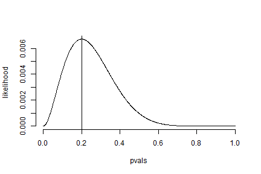
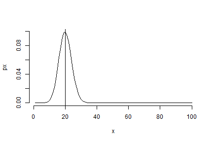
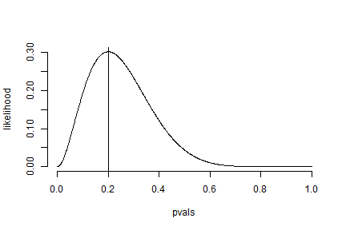
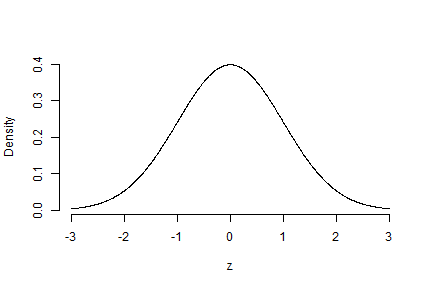
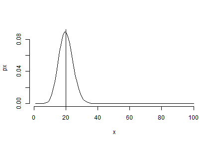
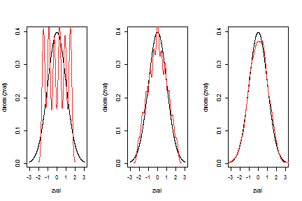
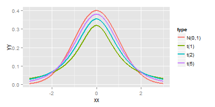
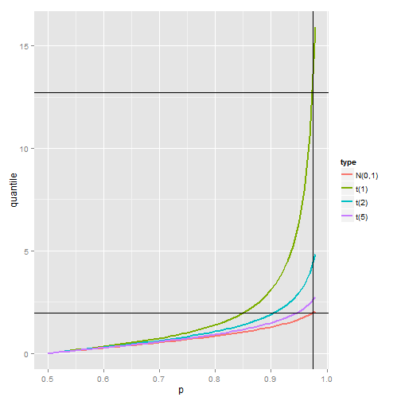

# codes in class

### Common Distributions

#### 1. Bernoulli distribution
Bernoulli distribution is the result of binary outcome. Bernoulli random variable take values only **0** or **1** with a probability $p$. 
The PMF of Bernoulli distribution: $$P(X=x)=p^{x}(1-p)^{1-x}$$ 
For example, we observe the following sequences for 10 Bernoulli trials:

``` 
0,0,1,0,0,0,1,0,0,0 
```

in the above Bernoulli trials, we have 2 successes out of 10 trials, i.e. $n = 10, x = 2$. Then maximum likelihood estimator for $p$ *could* be $2/10=0.2$. But let's check whether it is *the maximum likelihood* (MLE).


```r
pvals = seq(0, 1, length=1000)  # try all possible p
# the likelihood of observing the exampler sequence under each probability
n = 10; x = 2; 
likelihood = pvals^x*(1-pvals)^(n-x) 
plot(pvals, likelihood, type="l", frame=FALSE)
abline(v=0.2)
```

 

The plot shows $\hat{p}=k/n$ is the MLE for $p$.


#### 2. Binomial distribution
Binomial random variables are obtained as the sum of Bernoulli trials. The PMF for Binomial distribution is: $$P(X=x)=\binom{n}{x}p^{x}(1-p)^{1-x}$$ 
For the above Bernoulli trials, $x=2$.

Given $p$ and the number of Bernoulli trials, we can solve MLE of sucessess:

```r
n = 100
x=1:n
p=0.2;
px = choose(n,x) * p^x * (1-p)^(n-x)
plot(x, px, type="l", frame=FALSE)
abline(v=20)
```

 

Reversely, given a binomial observation, we can also solve MLE of Bernoulli p

```r
pvals = seq(0, 1, length=1000)  # try all possible p
n = 10; x = 2; 
# the likelihood of observing 2 successes in 10 trials under each probability
likelihood = choose(n,x) * pvals^x*(1-pvals)^(n-x) 
plot(pvals, likelihood, type="l", frame=FALSE)
abline(v=0.2)
```

 

Note: binomial observation care only the number of successes. It does not care the order of successes.


#### 3. Normal distribution

```r
zval = seq(-3,3,length=1000)
plot(zval, dnorm(zval), type="l", frame=FALSE, xlab="z", ylab="Density")
```

 

#### 4. Posisson distribution 

PMF of Poisson distribution: $$P(X=x,\lambda ) = \frac{\lambda^{x}e^{-\lambda}}{x!}$$
and $E(X)=Var(X)=\lambda$

$\lambda$ can also be with unit:$X\sim Poisson(\lambda t)$, where $\lambda$ is the cout per unit of time. Here $E(\hat{\lambda})=X/t$ and $Var(\hat{\lambda})=Var(X/t)= \hat{\lambda}/t$

```r
n = 100; x=1:n; lambda = 20;
px = (lambda^x * exp(-lambda))/factorial(x)
plot(x, px, type="l", frame=FALSE)
abline(v=20)
```

 

Note: Poisson can be good approximation for binomial random variables by $\lambda = n * p$ when $n$ is large and $p$ is small.

### Asymptoptics

#### 1. The Law of Large Numbers: LLN

```r
n = 10000
nrn = rnorm(n)  # n normal random variables
means = cumsum(nrn)/(1:n)  # the mean of the first i normal variables
plot(1:n, means, type="l", frame=FALSE)
abline(h=0)  # the average converges to what thery are estimating
```

 

the LLN says: the average of iid samples converge to the population mean 

#### 2. The Central Limit Theorem: CLT

```r
# dices experiment
obs1 = ceiling(runif(5000,min=0,max=6)) 
obs2 = ceiling(runif(5000,min=0,max=6))  
obs3 = ceiling(runif(5000,min=0,max=6))  
obs4 = ceiling(runif(5000,min=0,max=6))  
obs5 = ceiling(runif(5000,min=0,max=6)) 
obs6 = ceiling(runif(5000,min=0,max=6))  
# take only one observation for each die
mean_oneobs = obs1
z_oneobs = (mean_oneobs-3.5)/1.71
# take two observations for each die
mean_twoobs = (obs1 + obs2)/2
z_twoobs = (mean_twoobs-3.5)/1.71*sqrt(2)
# take six observations for each die
mean_sixobs = (obs1 + obs2 +obs3 +obs4 +obs5 +obs6)/6
z_sixobs = (mean_sixobs-3.5)/1.71*sqrt(6)
par(mfrow=c(1,3))
plot(zval, dnorm(zval), type="l")
lines(density(as.numeric(z_oneobs)),col = "firebrick2")
plot(zval, dnorm(zval), type="l")
lines(density(as.numeric(z_twoobs)),col = "firebrick2")
plot(zval, dnorm(zval), type="l")
lines(density(as.numeric(z_sixobs)),col = "firebrick2")
```

 

the CLT says: the averages are approximately ~ N(mean, sd of mean)


#### 3. practical use of CLT: confidence interval

```r
# library(UsingR)
# data(father.son)
# x<-father.son$fheight
# mean(x)+c(-1,1)*qnorm(0.975)*sd(x)/sqrt(length(x)) #95% confidence interval

# try with binomial distribution
# p(est) + c(-1,1) * qnorm(0.975) * sqrt(p*(1-p)/n)
0.1 +  + c(-1,1) * qnorm(0.975) * sqrt(0.1*(1-0.9)/100)
```

```
## [1] 0.0804 0.1196
```

```r
# a good estimate of the above equation for 95% confidence interval:
# p(est) + c(-1,1) * 1/sqrt(n)
0.1 +  + c(-1,1) * 1/sqrt(100)
```

```
## [1] 0.0 0.2
```

```r
# also native:
binom.test(10, 100)$conf.int
```

```
## [1] 0.0490 0.1762
## attr(,"conf.level")
## [1] 0.95
```

To sum: CLT suggests the confidence level of $\bar{X}$ is $\bar{X}\pm z_{1-\alpha/2}\sigma/\sqrt{n}$ (regardless of the distribution of $X$, as long as it is well normalized.)


#### 4. T confidence interval
t-distribution v.s. z-distribution (standard normal):

* t-distribution has a thicker tail; 
* t-distribution is only indexed by degree of freedom; while z-distribution is indexed by $\mu$ and $\sigma$;
* as the degree of freedom gets bigger, t-distribution will approach z-distribution.
    + $\frac{\bar{X}-\mu}{S/\sqrt{n}}\sim t(n-1)$
    + $\frac{\bar{X}-\mu}{\sigma/\sqrt{n}}\sim N(0,1)$
    
 

* confidence interval: 
    + t-distribution: $Est\pm tQ*SE_{Est}$
    + z-distribution: $Est\pm zQ*SE_{Est}$
    + t always has a wider interval; but for large N, t-quantile converges to z-quantile.

 

